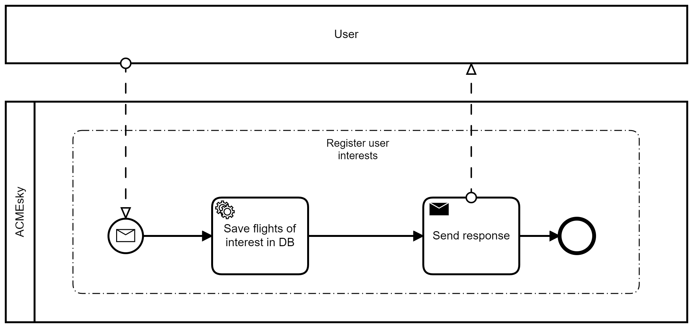
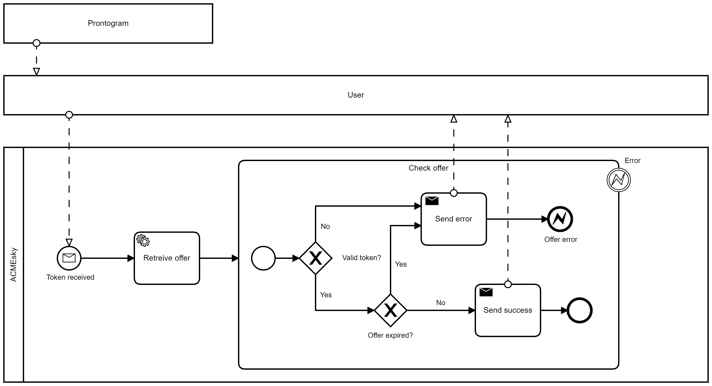
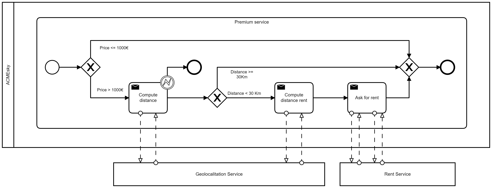
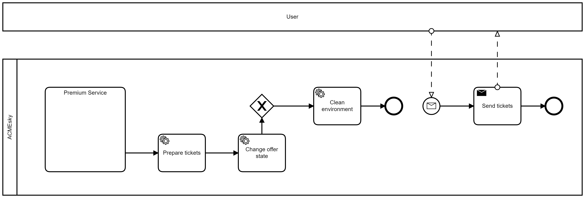

# Diagramma BPMN

In questa sezione della documentazione viene descritto il diagramma BPMN della _Service Oriented Architecture_ (SOA), nel quale viene mostrato come i servizi ed __ACMEsky__ interagiscono tra loro al fine di realizzare le funzionalità richieste. Per una migliore specificità e gestione della documentazione il diagramma verrà diviso in parti relative alle varie azioni degli attori, come ad esempio: la registrazione dell'interesse utente, la ricerca dei voli, salvataggio di quelle last-minute, gestione delle offerte e pagamento, ecc.

## Ricerca voli

La ricerca delle dei voli alle viene ripetuta con un certo intervallo di tempo, per evitare sovraccaricare i sistemi. Per questo i voli delle offerte di interesse degli utenti vengono salvate sul DB per _"bufferizzarle"_, in modo da non perderle ed utilizzarle per cercare i voli delle compagnie aeree. L'intervallo di tempo è variabile da 1 ora a pochi minuti poichè si cerca un compromesso tra un sistema efficiente e un sistema che non faccia aspettare troppo l'utente.

Quindi, ad un certo intervallo e per ciascun __Airline Service__, __ACMEsky__ recupera i voli di interesse degli utenti dal suo Database ed effettua una ricerca mirata dei voli compatibili con essi attraverso una chiamata ad una risorsa dei servizi di volo. 
I voli presenti nella risposta vengono salvati all'interno del database (tabella _available_flights_). 
Se il timer della richiesta scade, per cause dovute ad __Airline Service__, il sottoprocesso termina e si passa ad un'altra compagnia.

---

## Registrazione delle offerte last-minute

In questa parte si descrive il processo di ricezione e salvataggio dei voli last-minute. I servizi di __Airline Service__ mandano voli last-minute appena creati ad __ACMEsky__, la quale salva ciascuno di essi nel database, nello specifico nella tabella _available_flights_.

---

## Match voli con interesse utente

La generazione delle offerte di volo viene fatta ad un certo intervallo di tempo, ciò consente di non sovraccaricare il sistema e di evitare problemi di concorrenza con altri processi che generano le offerte. Per questo motivo, i voli delle offerte di interesse degli utenti vengono salvati sul database finchè non vengono utilizzati dal processo. L'intervallo di tempo è variabile da un'ora a pochi minuti poichè si cerca un compromesso tra un sistema efficiente e un sistema che non faccia aspettare l'utente.

Ogni ora, per ciascun offerta di interesse, __ACMEsky__ cerca tra i voli disponibili presenti nel database (tabella _available_flights_), se c'è una corrispondenza con l'interesse dell'utente allora prepara l'offerta, la salva nel database e la invia all'utente attraverso __Prontogram__. In caso negativo semplicemente il flusso termina passando all'interesse successivo.

---

## Registrazione dell'interesse dell'utente

Il seguente diagramma descrive il processo di raccolta e registrazione degli interessi degli utenti. L'utente descrive i suoi voli di interesse specificando: città/aereoporto di partenza, città/aereoporto di arrivo, data di partenza, data ritorno e quota massima di spesa.
__ACMEsky__ salva i voli di interesse nel suo database, in particolare, nella tabella _flights_interest_ e in _users_interests_, che contiene l'interesse per uno specifico viaggio. 
Infine, __ACMEsky__ invia la conferma di avvenuta creazione.

---

## Conferma di acquisto, applicazione servizi premium e preparazione biglietti

In questa parte del diagramma viene illustrata la conferma di acquisto dell'offerta da parte dell'utente, l'acquisto dell'offerta e l'applicazione dei servizi premium se l'offerta rispetta le caratteristiche necessarie. 
Infine, viene preparato il biglietto che poi l'utente potrà scaricare. 

Per una magiore comprensione il diagramma è stato diviso in blocchi più piccoli.

### Conferma dell'offerta da parte dell'utente

L'app di __Prontogram__ notifica l'utente del fatto che c'è un'offerta disponibile.

L'utente riceve l'offerta e può decidere se confermarla o meno attraverso l'invio di un token legato all'offerta stessa. __ACMEsky__ recupera l'offerta corrispondente al token e si occupa di verificarne la validità, ovvero, di controllare che il tempo di accettazione dell'offerta non sia terminato. In caso positivo si verifica se l'offerta di volo non sia scaduta e se anche in questo caso l'esito è positivo si invia all'utente la conferma di accettazione dell'offerta.
In caso contrario lo si informa dell'esito negativo dovuto alla scadenza dell'offerta o del token non valido ed il flusso termina con un errore.

### Pagamento dei voli

Il sottoprocesso inizia con la richiesta, da parte dell'utente, di pagamento del biglietto relativo all'offerta accettata. __ACMEsky__ a questo punto si prende l'onere di prenotare i biglietti facendone richiesta all'__Airline Service__ che fornisce i voli dell'offerta, la quale invierà in risposta i biglietti. Se c'è un errore relativo all'impossibilità di prenotare l'offerta poichè al servizio di airline risulta che l'offerta sia già stata acquistata o per qualsiasi altro problema, si invia un messaggio di errore all'utente ed il flusso termina. 

Se la prenotazione va a buon fine, __ACMEsky__ chiederà il link di pagamento a __Bank Service__, la quale glielo invierà in risposta a meno di errori nel processo. Successivamente il link viene inoltrato all'utente che procederà al pagamento sulla piattaforma di __Bank Service__. Infine, __Bank Service__ comunica l'esito ad __ACMEsky__ che proseguirà nel sottoprocesso dei servizi premium.
Se il servizio della banca non risponde entro 5 minuti dalla generazione del link si procede alla compensazione dei biglietti e del pagamento, in via preventiva. In questo caso il processo termina con errore.

### Servizi Premium voli

In questa fase, se vengono rispettate le condizioni, vengono applicati all'offerta i servizi premium. Inizialmente __ACMEsky__ controlla il prezzo dell'offerta, se questo supera i mille euro invia una richiesta al servizio di __Geolocalizzazione__ per calcolare la distanza dell'utente dall'areoporto. Nel caso in cui la distanza sia superiore ai 30 km si richiede al __Rent Service__ più vicino se c'è la possibilità di offrire all'utente un trasferimento dal suo domicilio all'aereoporto. Questa operazione viene ripetuta sia all'andata che al ritorno, e in tal caso modificherà i biglietti includendo tutte le informazioni dei due trasferimenti. In caso la distanza sia inferiore ai 30Km o il prezzo dell'offerta sia inferiore a 1000€ non verrà richiesto nessun servizio.

---

## Invio Biglietti

Arrivati a questo punto viene cambiato lo stato dell'offerta e viene preparato il pdf contenente i biglietti che l'utente potrà scaricare. L'utente può in qualunque momento richiedere i biglietti che ha acquistato.

---

## Rimozione dei voli scaduti

Il processo di cancellazione dei voli scaduti presenti nel database avviene ogni 12 ore. I voli scaduti sono quei voli la cui data di scadenza è antecedente a quella in cui si effettua l'operazione di cancellazione. La cancellazione non comporta l'eliminazione effettiva del record che rappresenta quel volo, bensì un cambiamento di stato che porta ACMEsky a non considerare più quel volo come disponibile.

---

## Rimozione delle offerte scadute

Il processo di cancellazione delle offerte scadute presenti nel Database avviene ogni 12 ore. Le offerte di volo scadute comprendono i voli di andata e ritorno. Le offerte scadute sono quelle la cui data di scadenza del volo di partenza è antecedente a quella in cui si effettua l'operazione di cancellazione. La cancellazione non comporta l'eliminazione effettiva del record, bensì, un cambiamento di stato che porta ACMEsky a non considerare più i voli dell'offerta (e l'offerta in sè) come disponibili.

---
&nbsp;

