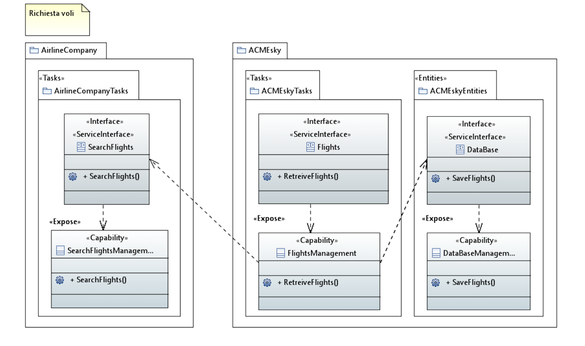
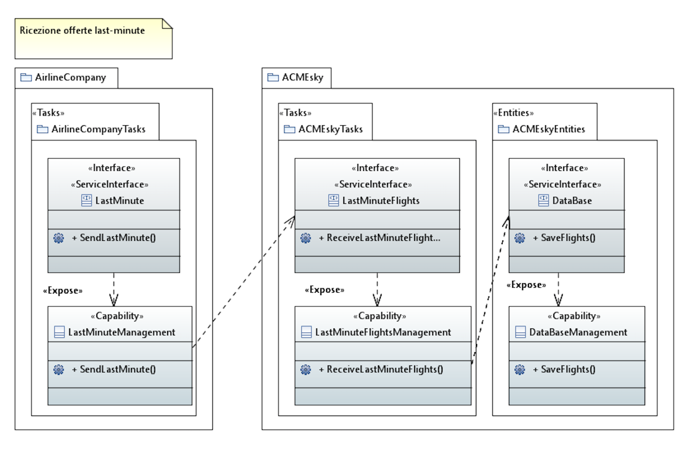
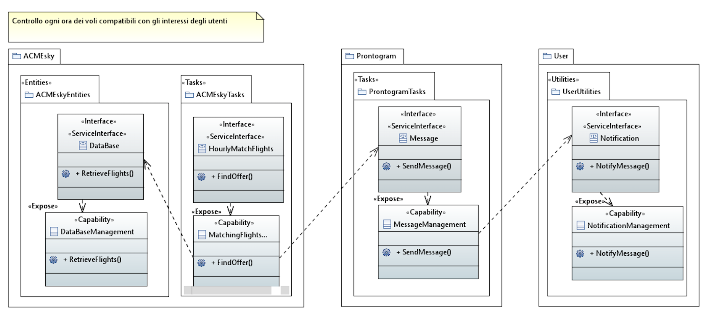
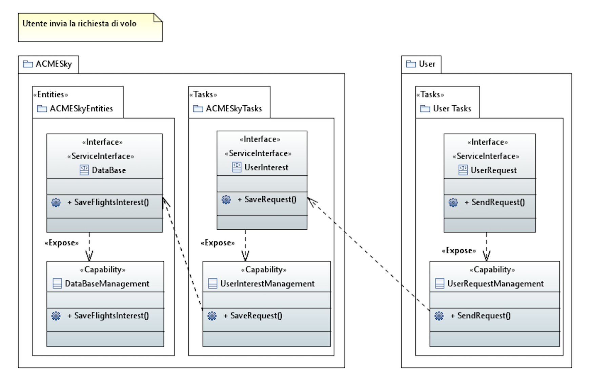
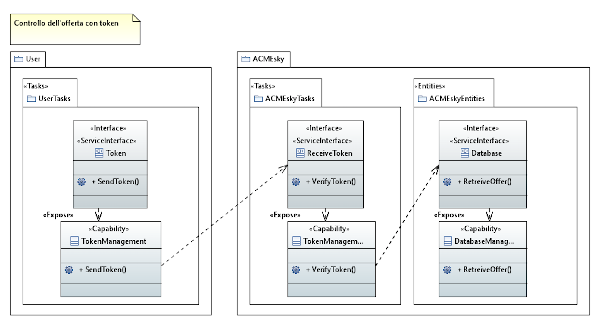
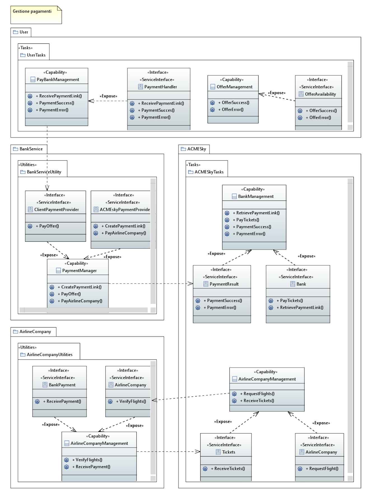

# Diagrammi UML

In questa sezione della documentazione viene descritta la modellazzione della "Service Oriented Architecture" (SOA) di cui fa parte l'organizzazione ACMESky, sotto forma di diagrammi UML. Quest'ultimi sono stati implementati utilizzando il profilo TinySOA.

Lo scopo principale dei digrammi UML di seguito descritti, consiste nel riportare le interazioni che vi sono tra i vari servizi che fanno parte della SOA, attraverso l'esposizione di *capability* e interfacce che le espongono.

Nei diagrammi UML vengono riportati tre diverse tipologie di servizi:

* **Task**: espone le *capability* facenti parte dei processi interni all'organizzazione;

* **Entity**: fa riferimento ad una singola attività, possibilmente automatizzata (ad esempio: il salvataggio di un record all'interno di un Database);

* **Utility**: sono simili ai task, però non appartengono al dominio del problema (ad esempio: utilizzo di capability legate a servizi esterni).

### Richiesta voli

Nel diagramma riportato qui sopra vengono descritte le *capabilty* inerenti alla richiesta voli. In particolare per il ruolo di ACMESky vengono esposte le seguenti *capability*: *FlightsManagement* e *DatabaseManagement* le quali vengono esposte da due interfacce *Flights* e *DataBase*.
La capability *FlightsManagement* ha lo scopo di interrogare e ricevere le offerte di voli dalle compagnie aeree. Mentre la capability *DatabaseManagement* si occupa di salvare le offerte ricevute dalle compagnie aeree nella base dati di ACMESky.

### Ricezione offerte last-minute

Nel diagramma riportato qui sopra vengono descritte le capabilty inerenti alla ricezione delle offerte last-minute. In particolare per il ruolo di ACMESky vengono esposte le seguenti *capability*: *LastminuteFlightsManagement* e *DatabaseManagement* le quali vengono esposte da due interfacce *LastMinuteFlights* e *DataBase*.
La capability *FlightsManagement* ha lo scopo di ricevere le offerte dei voli last-minute dalle compagnie aeree. Quest'ultime verranno poi memorizzate nella base dati  attraverso la capability *DatabaseManagement*.

### Controllo periodico dei voli compatibili con gli interessi degli utenti 

Nel diagramma riportato qui sopra vengono descritte le capabilty inerenti alla ricezione delle offerte last-minute. In particolare per il ruolo di ACMESky vengono esposte le seguenti *capability*: *MatchingFlightsManagement* e *DatabaseManagement* le quali vengono esposte da due interfacce *HourlyMatchFlights* e *DataBase*.
La capability *MatchingFlightsManagement*, dopo avere reperito i voli dalla base dati attraverso *DatabaseManagement*, ha lo scopo di trovare l'offerta compatibile con quella di interesse per l'utente. Inoltre la capability *MatchingFlightsManagement* dipende dalla capability di invio messaggi di ProntoGram, *MessageManagement* esposta dalla relativa interfaccia: *Message*.
Per contattare l'utente la capability di ProntoGram (*MessageManagement*) dipende da un'altra capability *NotifyMessage* la quale ha lo scopo di segnalare all'utente la presenza di nuovi voli attraverso un messaggio di notifica.

### Invio richiesta del volo da parte dell'utente

Nel diagramma riportato qui sopra vengono descritte le capabilty inerenti all'invio da parte di un utente della richiesta di un volo.
In particolare per il ruolo di ACMESky vengono esposte le seguenti *capability*: *UserInterestManagement* e *DatabaseManagement* le quali vengono esposte da due interfacce rispettivamente *UserInterest* e *DataBase*.
In particolare la capability *UserInterestManagement* si occupa di ricevere la richiesta di un volo da parte di un utente esponendo quindi una dipendenza per la capability *UserRequestManagment*, la quale ha lo scopo di inviare la richiesta dell'utente.
Invece, la capability *DatabaseManagement* si occupa di salvare la richiesta nella base dati di ACMESky.

### Controllo dell'offerta con token

Nel diagramma riportato qui sopra vengono descritte le capabilty inerenti al controllo dell'offerta di interesse attraverso l'utilizzo del token inviato dall'utente.
In particolare per il ruolo di ACMESky vengono esposte le seguenti *capability*: *TokenManagement* e *DatabaseManagement* le quali vengono esposte da due interfacce rispettivamente *ReceiveToken* e *DataBase*.
Queste capability permettono al sistema di ricevere il token da parte di un utente, verificare la correttezza del token ricevuto e reperire la relativa
offerta dalla base dati di ACMESky.
 La capability *TokenManagement* dipende dalle interfacce che espongono la capability *TokenManagement* dell'utente per poter verificare la validità del codice inserito.

### Gestione dei pagamenti

Nel diagramma riportato qui sopra vengono descritte le capabilty inerenti alla gestione dei pagamenti effettuati dall'utente indirizzati ai vari servizi.
In particolare per il ruolo di ACMESky vengono esposte le seguenti *capability*: *PaymentResult* e *Bank* le quali vengono esposte da un'unica interfaccia *BankManagement*.
La capability *BankManagement* si occupa di pagare il biglietto 
La capability *PaymentResult* gestisce il successo o l'insuccesso di un avvenuto pagamento e 

### Servizi accessori e ricezione tickets

