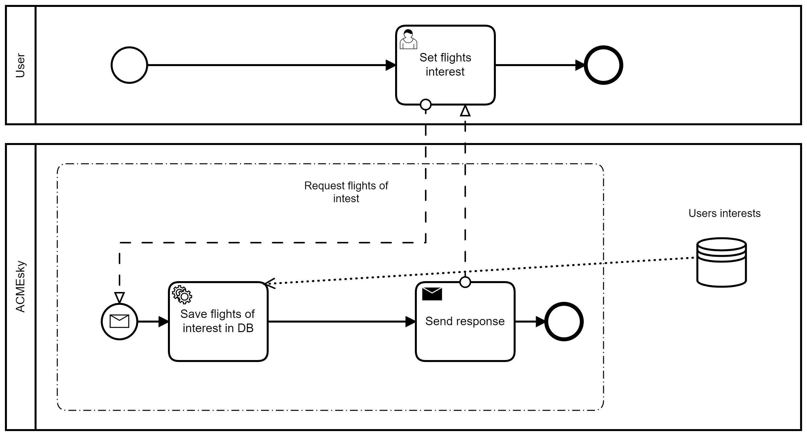
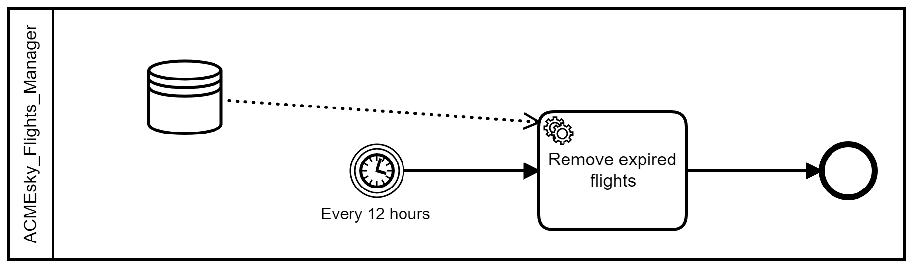
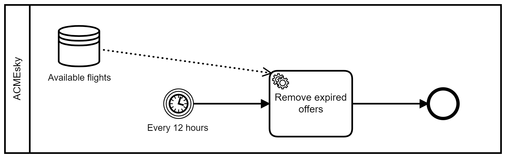
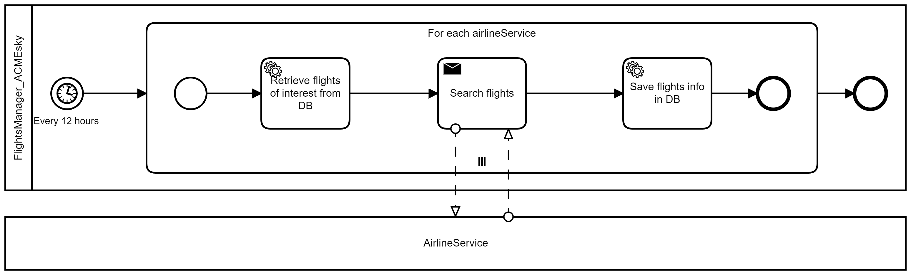
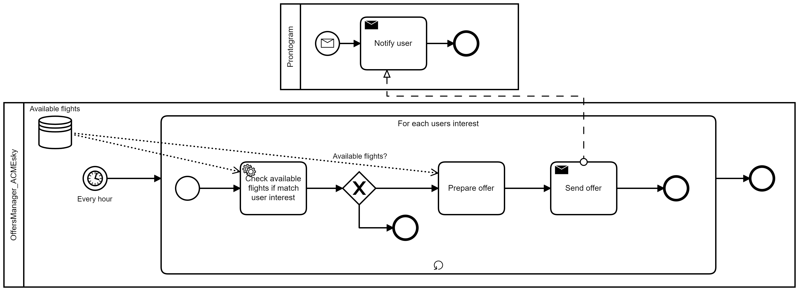
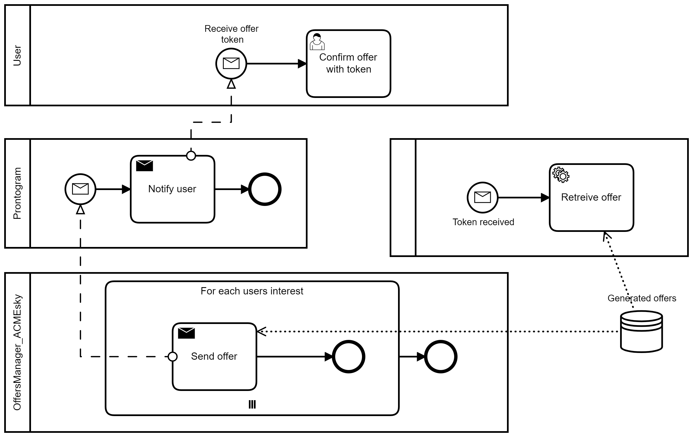
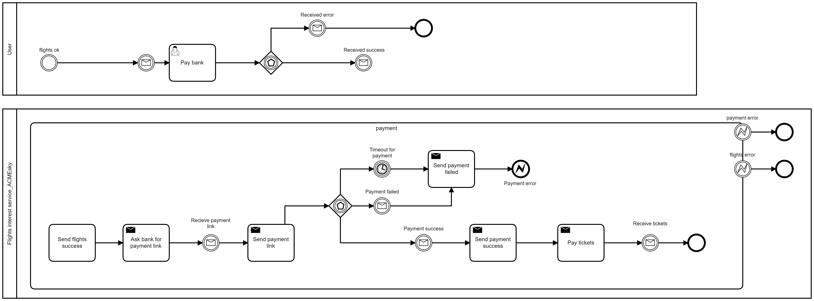
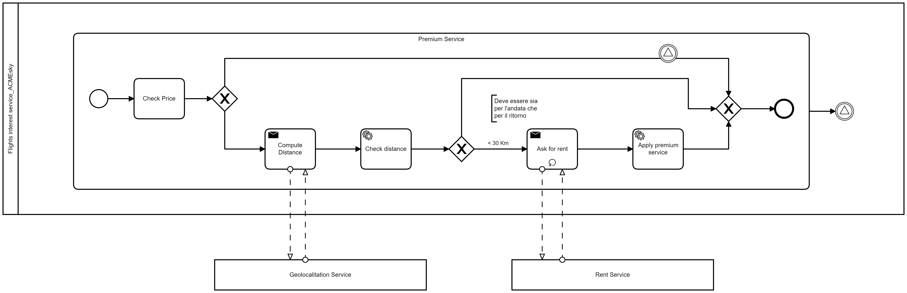

# Documentazione bpmn

In questa sezione della documentazione si descrive il diagramma BPMN, in cui si rappresentano le coreografie già costruite e descritte in precedenza. Per una migliore specificità e gestione della documentazione il diagramma verrà diviso in parti relative alle varie funzionalità del progetto (es. registrazione interesse utente, ricezione offerte last-minute, ecc.) e in ciascuna parte si descriverà come gli attori e il sistema interagiscono nell'implementazione. 

## Registrazione interesse utente

Il seguente diagramma descrive il processo di raccolta e registrazione dei voli di interesse degli utenti. Un utente si registra sulla piattaforma ACMEsky e descrive i suoi voli di interesse, ovvero i voli di cui ha bisogno, specificando città/aereoporto di partenza, città/aereoporto di arrivo, data e ora di partenza e arrivo del volo. ACMEsky salva i voli di interesse nel suo Database, in particolare nella tabella "User Interests" e invia la conferma di accettazione all'utente.

## Registrazione offerte last-minute

In questa parte si descrive il processo di ricezione e salvataggio di voli last-minute. I servizi di Airline Service mandano voli last-minute ad ACMEsky, la quale salva ciascuno di essi nel suo Database, nello specifico nella tabella Available flights.

## Rimozione dei  voli last-minute scaduti

Il processo di eliminazione dei voli scaduti presenti nel Database avviene ogni 12 ore. I voli scaduti sono quei voli che hanno la data di partenza è antecedente a quella in cui si effettua l'operazione di cancellazione. 

## Rimozione delle offerte scadute

Il processo di eliminazione delle offerte di volo scadute presenti nel Database avviene ogni 12 ore. Le offerte di volo scadute comprendono uno o più voli la cui data di partenza è antecedente a quella in cui si effettua l'operazione di cancellazione. 

## Registrazione voli

Ogni 12 ore e per ciascun Airline Service, ACMEsky recupera i voli di interesse degli utenti dal suo Database ed effettua una ricerca mirata dei voli compatibili con essi attraverso una chiamata ad una risorsa dei servizi di volo. I voli presenti nella risposta vengono salvati all'interno del DB. Se passa una certa quantità di tempo dovuto a ritardi o mancate risposte da parte dei Airline Service, per evitare che il flusso di esecuzione del sistema si fermi e non vada più avanti si è deciso di farlo terminare.

## Match voli con interesse utente

Ogni ora e per ciascun volo di interesse ACMEsky cerca tra i voli disponibili presenti nel DB se c'è una corrispondenza con il volo di interesse in esame. In caso negativo semplicemente il flusso termina, altrimenti si procede alla preparazione ed al salvataggio in DB dell'offerta comprensiva di tutti i voli che l'utente cercava. Infine l'offerta di volo viene inviata all'utente attraverso l'app di Prontogram e il flusso termina.

## Conferma del lavoro da parte dell'utente

L'App di Prontogram notifica l'utente del fatto che c'è un volo corrispondente ai voli di interesse richiesti e termina il suo flusso. L'utente riceve l'offerta e può decidere se confermarla o meno attraverso l'invio di un token legato all'offerta stessa. ACMEsky recupera l'offerta corrispondente al token e si occupa di verificare la validità del token, ovvero di controllare che il tempo di accettazione dell'offerta non sia terminato. In caso positivo si invia all'utente la conferma di accettazione, in caso negativo lo si informa dell'esito ed il flusso termina con un errore.

## Pagamento dei voli

 Il processo di pagamento inizia con un messaggio dell'utente in cui manifesta la volontà di pagare i biglietti relativi all'offerta accettata. ACMEsky a questo punto si prende l'onere di prenotare i biglietti facendone richiesta all'Airline Service che offre i voli dell'offerta, la quale invierà in risposta i biglietti. Se c'è un errore relativo all'impossibilità di prenotare l'offerta si invia un messaggio di errore all'utente ed il flusso termina. Se invece la prenotazione va a buon fine e ACMEsky dispone dei biglietti chiederà il link di pagamento a Bank Service, la quale glielo invierà in risposta. Il link viene sottoposto all'utente il quale sceglierà se pagare o meno. Se è intenzionato a pagare effettua il pagamento e riceverà risposta da Bank Service per comunicargli che il pagamento verrà preso in carico. Bank Service comunica l'esito del pagamento all'utente ad ACMEsky la quale può decidere di chiudere il flusso di pagamento e continuare con la raffinazione dei biglietti dell'offerta, oppure occuparsi della compensazione. La compensazione consiste nell'eliminare i biglietti relativi all'offerta e comunicare all'Airline Service che i voli dell'offerta non sono più in stato di prenotazione e ritornano disponibili per altri utenti. In tal caso il flusso termina con un errore.

## Servizi Premium voli

In questa fase ci si occupa della raffinazione del servizio che ACMEsky offre ai suoi utenti. All'inizio controlla il prezzo dell'offerta del cliente. Se questo supera i mille euro si invia una richiesta al servizio di geolocalizzazione per conoscere la posizione dell'utente, in seguito alla risposta sarà in grado di calcolare la distanza tra il domicilio dell'utente e l'aereoporto di partenza. Nel caso in cui la distanza sia superiore ai 30 km si richiede al Rent Service più vicino se c'è la possibilità di offrire all'utente un trasferimento gratuito dal suo domicilio all'aereoporto, e nel caso modificherà i biglietti includendo tutte le informazioni necessarie del trasferimento di andata e ritorno. Chiaramente in caso la distanza sia inferiore il servizio di trasferimento non è disponibile. In caso il prezzo dell'offerta sia inferiore alla soglia nessun servizio premium verrà offerto. A prescindere dal caso il flusso termina

## Invio Biglietti

Nel caso in cui ci siano stati errori in precedenza legati al mancato pagamento o errori di pagamento dell'utente piuttosto ad errori riguardanti l'applicazione dei servizi premium, questi verrano indivuati e gestiti in modo opportuno. In caso di mancanza di errori si cambierà lo stato dell'offerta riguardante l'acquisto e verranno inviati all'utente i biglietti.