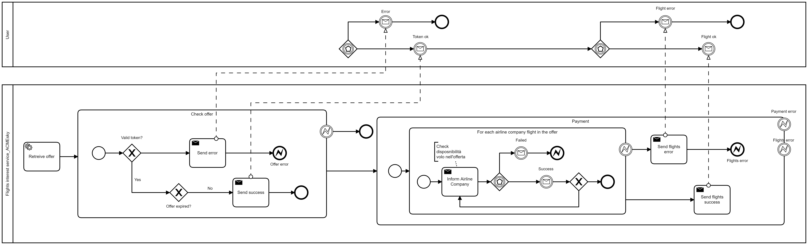

# Documentazione bpmn

```txt
In questa sezione della documentazione si descrive il diagramma BPMN, in cui si rappresentano le coreografie già costruite e descritte in precedenza. Per una migliore specificità e gestione della documentazione il diagramma verrà diviso in parti relative ad una determinata funzionalità del progetto (es. registrazione interesse utente, ricezione offerte last-minute, ecc.) e per ciascuna parte si parlerà di come è stata pensata prima dell'implementazione nella versione pre-implementazione, e poi dei cambiamenti che l'hanno trasformata nella versione post-implementazione. 
```

## Registrazione interesse utente


```txt
Il seguente diagramma descrive il processo di raccolta e registrazione dei voli di interesse degli utenti. Un utente si registra sulla piattaforma ACMEsky e descrive il suo interesse specificando città/aereoporto di partenza, città/aereoporto di arrivo, data e ora di partenza e arrivo del volo, eventualmente specificando anche le informazioni del volo di ritorno. ACMEsky salva volo/i di interesse nel suo Database come specificato dal simbolo di DB descritto come Flights of users interest.
```


## Registrazione offerte last-minute


```txt
Il seguente diagramma descrive il processo di ricezione e salvataggio di voli last-minute. Le due istanze di servizi di AirlineService creano offerte di voli ogni 6 secondi e se queste sono offerte last-minute ne invia i rispettivi voli.
```


## Registrazione voli


```txt
Il seguente diagramma descrive il processo di ricezione e salvataggio di voli last-minute. Le due istanze di servizi di AirlineService creano offerte di voli ogni 6 secondi e se queste sono offerte last-minute ne invia i rispettivi voli.
```


## Match voli con interesse utente


```txt

```

## Invio offerta all'utente


```txt

```

## Registrazione voli




```txt

```