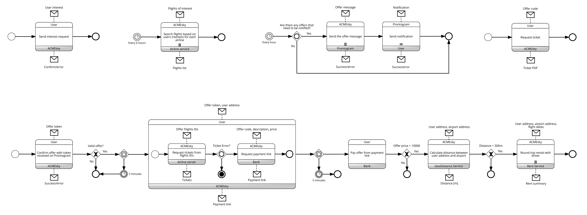
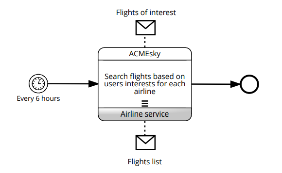
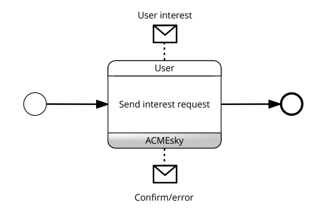
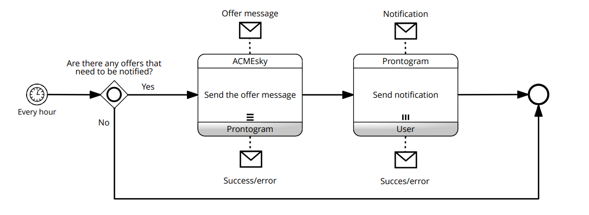
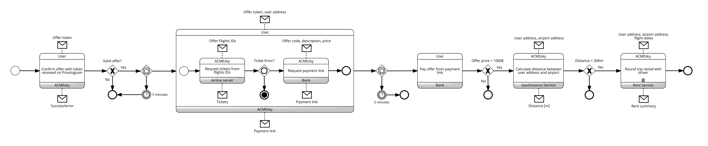
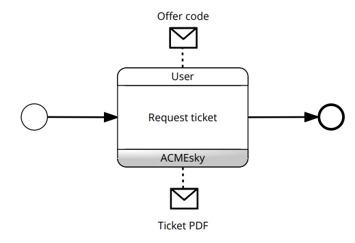

# Diagramma delle coreografie BPMN

## Diagramma completo

In questa sezione della documentazione si parla delle coreografie BPMN che descrivono alcune funzionalità del progetto. Per una esposizione più semplice si è deciso di suddividere il diagramma in parti con un flusso di esecuzione indipendente e spiegarle singolarmente.

## Ricerca dei voli di interesse

Il diagramma descrive l'interazione tra ACMEsky e una compagnia aerea al fine di cercare i voli che hanno una corrispondenza con quelli richiesti dagli utenti. Ogni sei ore e per ciascuna AirlineService registrata sul DB, ACMEsky recupera i voli di interesse degli utenti effettuando una richiesta all'AirlineService che restituisce la lista dei voli disponibili e non scaduti. Il flusso termina.

## Invio dell'offerta di interesse

Il diagramma descrive come l'utente e ACMEsky interagiscono nello scenario dell'invio delle offerte di interesse da parte degli utenti. L'utente manda una User Interest, ovvero l'offerta, mentre ACMEsky risponde con un messaggio di corretto inserimento o di errore nella richiesta. Finalmente il flusso termina.

## Generazione dell'offerta di volo

Il diagramma mostra come ACMEsky, Prontogram e l'utente si relazionano al fine di notificare l'utente della generazione dell'offerta di volo corrispondente a quella che aveva richiesta, ossia con gli stessi aereoporti di andata e ritorno, con la stessa data di partenza e ritorno e con il prezzo al di sotto della soglia stabilita. Ogni ora e se ci sono delle offerte di volo appena generate (altrimenti il flusso termina), ACMEsky manda un messaggio a Prontogram che a sua volta risponde con un messaggio di corretto inserimento o di errore nella richiesta. Successivamente in caso di esito positivo Prontogram manda una notifica all'utente il quale risponde con un messaggio di corretto inserimento o di errore nella richiesta. Infine il flusso termina.

## Conferma e acquisto dell'offerta

Il diagramma descrive come l'utente, ACMEsky, il servizio bancario, la compagnia aerea, il servizio di geolocalizzazione e quello di Rent interagiscono nel contesto della conferma e acquisto dell'offerta di volo da parte dell'utente. Quest'ultimo conferma la volontà di voler acquistare l'offerta proposta inserendo il token ricevuto sull'app di Prontogram ad ACMEsky, il quale risponde con un messaggio di corretto inserimento o di errore nella richiesta di acquisto. ACMEsky verifica che il token sia valido e che l'offerta non sia scaduta fino a questo momento. In caso la verifica abbia esito positivo il processo continua fino alla sub-choreography in cui l'utente passa il token dell'offerta ed il suo indirizzo per richiedere il pagamento. ACMEsky recupera gli identificativi dei voli dell'offerta corrispondente al token fornito dall'utente ed effettua una richiesta all'AirlineService che restituisce i biglietti relativi, e se l'offerta è ancora disponibile per l'acquisto ACMEsky procede con il recupero del link del pagamento alla banca fornendo i dettagli dell'offerta. La banca restituirà ad ACMEsky il link, che successivamente verrà inviato all'utente. Se l'utente non effettua il pagamento tramite il link fornitogli entro 5 minuti il processo termina, altrimenti pagherà alla banca il prezzo dei biglietti (quest'ultima si occuperà dell'accredito alla compagnia aerea). Se il prezzo dell'offerta è superiore a mille euro, ACMEsky calcolerà la distanza tra l'indirizzo dell'utente e quello dell'aereoporto di partenza dei voli dell'offerta inviando i rispettivi indirizzi al servizio di geolocalizzazione che restituirà la distanza tra i due punti, e se questa è superiore ai trenta chilometri, il servizio di ACME fornirà gli indirizzi dell'utente e dell'aereoporto di partenza e le date del viaggio al Rent Service che si organizzerà per accompagnare l'acquirente dal suo indirizzo all'aereoporto gratuitamente e restituirà il programma del servizio.

## Recupero del biglietto

Il diagramma descrive come l'utente richiede ad ACMEsky di visualizzare e ottenere il biglietto precedentemente acquistato. Quindi l'utente specifica il biglietto a cui è interessato inviando il codice dell'offerta di volo ed ACMEsky recupera il biglietto corrispondente al codice in formato PDF.
