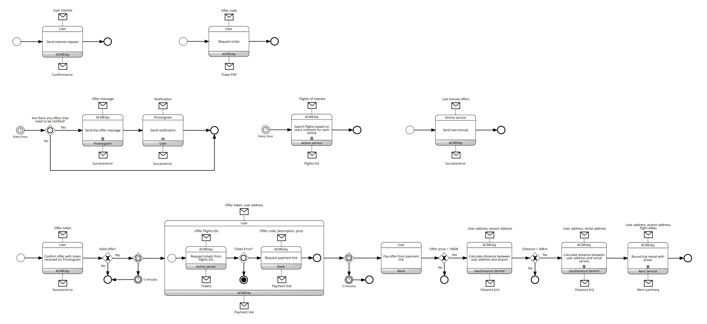
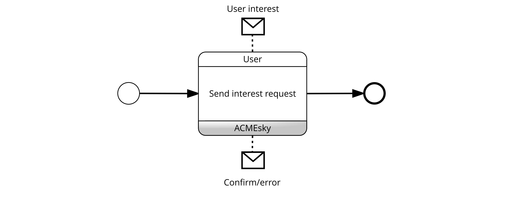
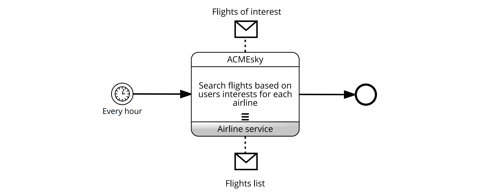
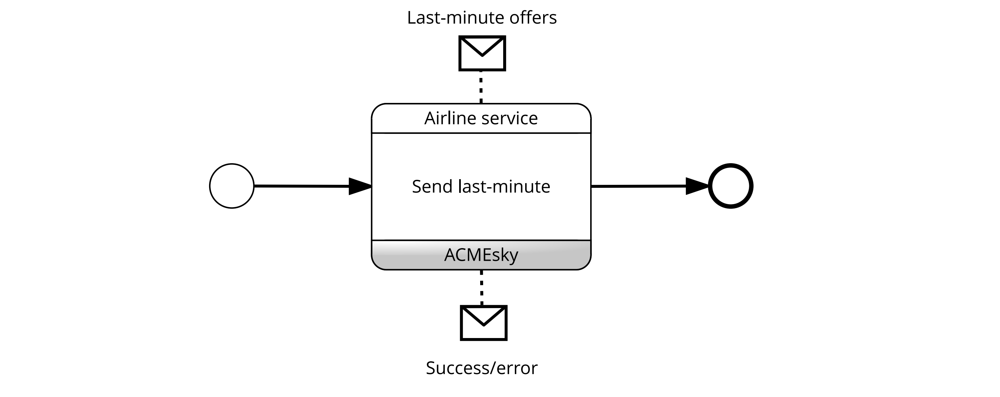
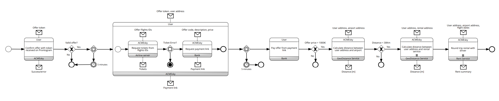

# Diagramma delle coreografie BPMN
In questa sezione vengono mostrate le coreografie BPMN.

## Diagramma completo

In questa sezione vengono mostrate le coreografie BPMN del sistema. Il diagramma è stato suddiviso in parti per poterle spiegare singolarmente.

## Salvataggio degli interessi

La coreografia descrive come l'utente e *ACMEsky* interagiscono nello scenario dell'invio degli interessi. L'utente manda una User Interest, mentre ACMEsky risponde con un messaggio di corretto inserimento o di errore nella richiesta.

## Ricerca dei voli di interesse

La coreografia descrive l'interazione tra *ACMEsky* e *Airline Service* al fine di cercare i voli che hanno una corrispondenza con quelli richiesti dagli utenti. Ogni ora e per ciascuna AirlineService registrata, *ACMEsky* recupera i voli di interesse degli utenti  e effettua una richiesta all'*Airline Service* che restituisce la lista dei voli disponibili.

## Registrazione dei voli last-minute

La coreografia descrive come *ACMEsky* e una compagnia aerea interagiscono nello scenario della ricezione e salvataggio dei voli last-minute. *Airline Service* invia i voli last-minute ad ACMEsky, che risponde con un messaggio di corretto inserimento o di errore nella richiesta.

## Generazione dell'offerta di volo

La coreografia mostra come *ACMEsky*, *Prontogram* e l'utente si relazionano al fine di notificare l'utente della corretta generazione dell'offerta. Ogni ora, e se ci sono delle offerte di volo appena generate (altrimenti il flusso termina), *ACMEsky* manda un messaggio a *Prontogram* che a sua volta risponde con un messaggio di corretto inserimento o di errore nella richiesta. Successivamente in caso di esito positivo *Prontogram* manda una notifica all'utente.

## Conferma e acquisto dell'offerta

La coreografia descrive come l'utente, *ACMEsky*, *Bank Service*, *Airline Service*, *GeoDistance Service* e *Rent Service* interagiscono nel contesto della conferma e acquisto dell'offerta di volo da parte dell'utente. Quest'ultimo conferma la volontà di voler acquistare l'offerta proposta inserendo il token ricevuto sull'app di Prontogram ad *ACMEsky*, il quale risponde con un messaggio di corretto inserimento o di errore nella richiesta. 

*ACMEsky* verifica che l'offerta sia ancora valida, se non lo è il flusso termina. Altrimenti, il processo continua fino alla sub-choreography, in cui l'utente passa il token dell'offerta ed il suo indirizzo per richiedere il pagamento, che deve svolgere entro cinque minuti, pena la fine del processo. 
*ACMEsky* recupera l'offerta corrispondente al token ed effettua una richiesta ad *Airline Service* che restituisce i biglietti. Se l'offerta è ancora disponibile per l'acquisto *ACMEsky* procede con il recupero del link del pagamento a *Bank Service* fornendo i dettagli dell'offerta. La banca restituirà ad ACMEsky il link, che successivamente verrà inviato all'utente. 
Se l'utente non effettua il pagamento tramite il link fornitogli entro cinque minuti il processo termina.

Se il prezzo dell'offerta è superiore a 1000€, *ACMEsky* calcolerà la distanza tra l'indirizzo dell'utente e quello dell'aereoporto di partenza inviando i rispettivi indirizzi al servizio di per l calcolo delle distanze che restituirà la distanza tra i due punti.
Se questa è superiore ai 30Km, *ACMEsky* si servirà nuovamente di *GeoDistanceService* per trovare la compagnia di noleggio più vicina.
Infine, viene prenotato il trasporto per l'andata e per il ritono.

## Recupero del biglietto

La coreografia descrive come l'utente richiede ad *ACMEsky* il biglietto precedentemente acquistato. L'utente specifica il biglietto a cui è interessato inviando il codice dell'offerta ed *ACMEsky* recupera il biglietto corrispondente al codice in formato PDF.

&nbsp;

