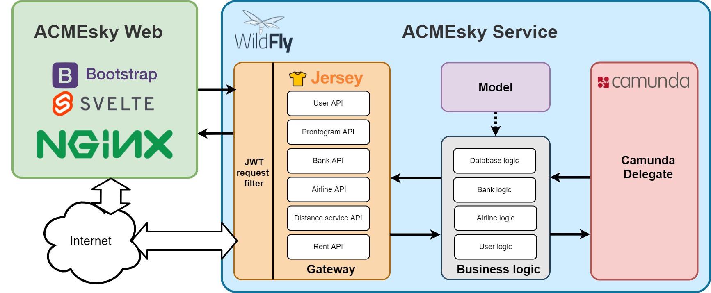
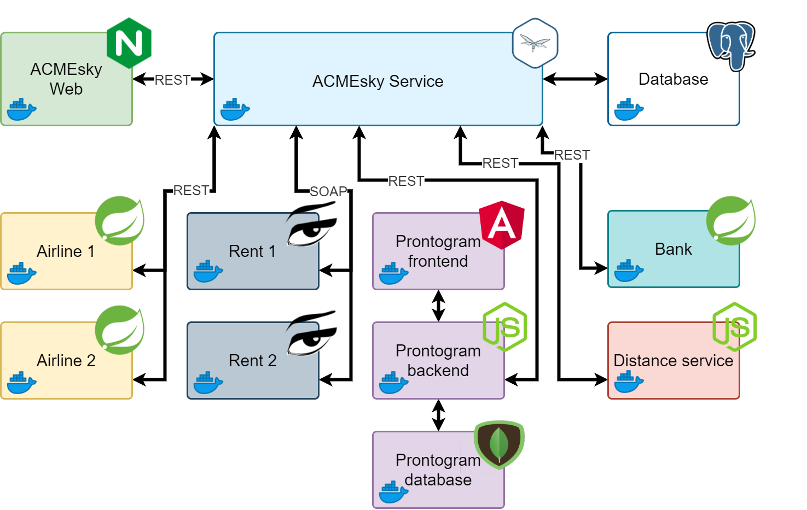

# Implementazione

In questa sezione si presenta la struttura del progetto, specificando per ciascun servizio le tecnologie impiegate e la struttura scelta per l'implementazione.

Come si può notare nell'immagine riportata qui sopra la struttura architetturale di ACMEsky Service è stata suddivisa in più parti, ognuna delle quali svolge un ruolo specifico all'interno del servizio di ACMEsky.
Attraverso il Camunda Delegate il codice Java di ACMEsky Service può accedere alle istanze dei modelli BPMN e agli elementi del flusso corrente.
Nel Model sono contenute tutte le classi contenenti tutti i dati che vengono utilizzate dall'applicazione per passare i dati tra i vari servizi di ACMEsky. Inoltre le classi del model corrispondono ai record presenti nel database attraverso l'uso del framework JPA (Java Persistence API) .
La Business logic comunica con il Modello e in essa sono contenute tutte le classi Java che si occupano di gestire la parte logica di elaborazione. Ovvero l'insieme di regole che determinano il modo in cui i dati vengono archiviati o manipolati all'interno di ACMEsky Service.
Il Gateway attraverso l'interazione con la Business logic raggruppa tutte le classi che implementano l'interfaccia REST di ACMEsky. Quest'ultime sono accessibili dall'esterno e vengono utilizzate per soddisfare le richieste da parte del client. Inoltre attraverso il "JWT request filter" il Gateway autentica ogni singola richiesta da parte di un'entità e successivamente la autorizza ad eseguire le richieste ad un certo path basandosi sul livello di autenticazione fatta. 
ACMEsky Web è la web application di ACMEsky che permette all'utente di eseguire le richieste alle API di ACMEsky Sevice in maniera più intuitiva. ACMEsky Web non è strettamente necessario per effettuare le richieste ai servizi esposti da ACMEsky Service in quanto quest'ultimo potrebbe essere utilizzato in modalità "stand alone" attraverso un client REST.

In questa sezione vengono descritti gli stili architetturali delle comunicazioni che avvengono tra i vari servizi implementati nel progetto.
Abbiamo utilizzato Docker per inserire tutti i servizi all'interno di container per simulare il più possibile un ambiente reale.
Per gestire la persistenza dei dati è stato utilizzato il database relazionale PostgreSQL il quale permette di eseguire delle query sui dati attraverso l'uso del linguaggio SQL.
Abbiamo utilizzato il framework Spring per implementare i servizi della banca e delle compagnie aeree. Un aspetto fondamentale del framework Spring è l'utilizzo del design pattern "dependency injection" attraverso il quale il contenitore Spring "inietta" oggetti in altri oggetti o "dipendenze". Ciò consente un accoppiamento lasco dei componenti e sposta la responsabilità della gestione dei componenti sul contenitore.
La parte front-end della web application di Prontogram è stata sviluppata utilizzando il framework Angular. Mentre la parte back-end (server di Prontogram) è stata implementata utilizzando node.js il quale espone API uniche che supportano le richieste HTTP.
ACMEsky Web è la web application di ACMEsky che permette all'utente di eseguire le richieste alle API di ACMEsky Sevice in maniera più intuitiva.
Tutti questi servizi comunicano con ACMEsky Service attraverso l'architettura REST basata sul protocollo http. Il funzionamento dell'architettura REST prevede una struttura degli URL ben definita che identifica univocamente una risorsa o un insieme di risorse e l'utilizzo dei metodi HTTP specifici per il recupero di informazioni (GET) e per la modifica (POST, PUT, PATCH, DELETE).
Il servizio di Rent è stato implementato utilizzando il linguaggio di programmazione Jolie che permette al servizio di comunicare con altri programmi inviando e ricevendo messaggi su una rete.
Come protocollo di comunicazione tra il servizio di Rent e ACMEsky Service abbiamo utilizzato SOAP.
Quest'ultimo è lo standard di comunicazione dei Web Service e permette la formattazione di messaggi XML-based. Questi messaggi sono inviati ad altri Web Service tramite HTTP/S. Il ricevente estrae le informazioni dal messaggio e le trasforma in un protocollo conosciuto dal sistema residente.
## ACMEsky

- ACMEskyWeb: servizio sviluppato con SvelteJS, framework opensource per il frontend 

- ACMEskyService: sviluppato utilizzando Java Enterprise Edition che implementa la specifica JAX-RS (Java API for RESTful Web Services), un set di interfacce e annotazioni che facilitano lo sviluppo di applicazioni lato server. Per quanto riguarda il deployment si è scelto Red Hat JBOSS Enterprise Application Platform che offre supporto completo a Java EE in tutti gli ambienti applicativi. Questa scelta è dovuta anche dal fatto che una delle distribuzioni di Camunda Platform si basa su JBOSS, oltre al fatto che la distribuzione basata su Apache potrebbe dare problemi Camunda è un Java-based framework che supporta BPMN 2.0 per il workflow e l'automazione dei processi a livello di produzione. La distribuzione di Camunda si trova su un container Docker sul quale si carica il file .war del servizio in modo da poter automatizzare i processi. Java EE consente di creare dei file .war molto leggeri escludendo le librerie necessarie che l'application server su cui viene eseguito dovrà recuperare. Ciò aumenta la flessibilità e la manutenibilità del codice, infatti un'implementazione personalizzata come RESTEasy è meno flessibile nel caso in cui si passasse ad un altro deployment.
Questa parte di ACMEsky si occupa di gestire le interazioni tra i vari servizi al fine di cercare e ottenere i voli dagli AirlineService, gestire le offerte con l'utente per mezzo del frontend, gestire il database, proporre all'utente le offerte basate sui suoi voli di interesse, procedere con la prenotazione, l'acquisto interagendo con il servizio bancario, l'applicazione di servizi aggiuntivi comunicando con i servizi di geolocalizzazione e di rent, e la preparazione dei biglietti.

- ACMEskyDB: la parte di ACMEsky utilizzata per la creazione, gestione ed eliminazione del Database utilizzato da ACMEskyService. Come Database si è scelto il DB gratuito ed open source di PostgreSQL, invece per la sua gestione si è scelto il tool di pgAdmin 4, il management tool open source di PostgreSQL.
Per rendere il tutto più portatile ed indipendente possibili si custodisce il Database e pgAdmin 4 su due container Docker.

## AirlineService(s)

Il servizio che simula delle semplici compagnie aeree. Al momento i servizi di Airline Service sono due: uno che offre voli nazionali e uno che offre voli internazionali, ma modificando il docker-compose è possibile aggiungerne di nuovi o rimuovere quelli già presenti.

## BankService

## GeographicalDistanceService
Geographical Distance Service è il servizio di geolocalizzazione che calcola la distanza tra due indirizzi.

## Prontogram
Web-application che permette all'utente di ricevere le notifiche delle offerte dei voli dai servizi di ACMEsky. L'applicativo è stato sviluppato in Angular per quanto riguarda la parte front-end e in node.ja per quanto riguarda la parte back-end (server).

## RentService(s)
Rent Service è il servizio che offre la possibilità di accompagnare l'utente dal suo indirizzo domicilio all'aeroporto di partenza gratuitamente.
&nbsp;

